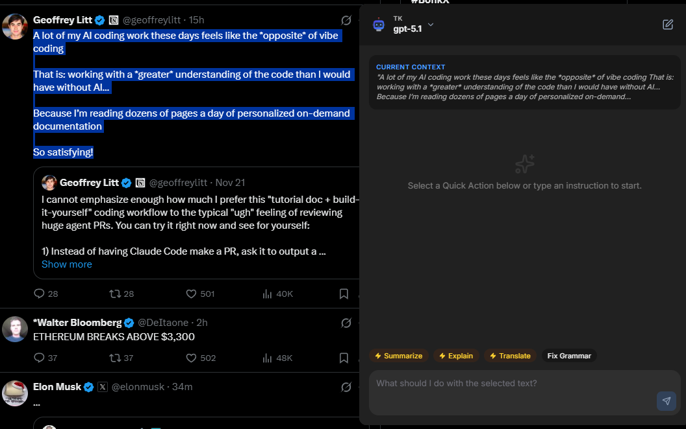
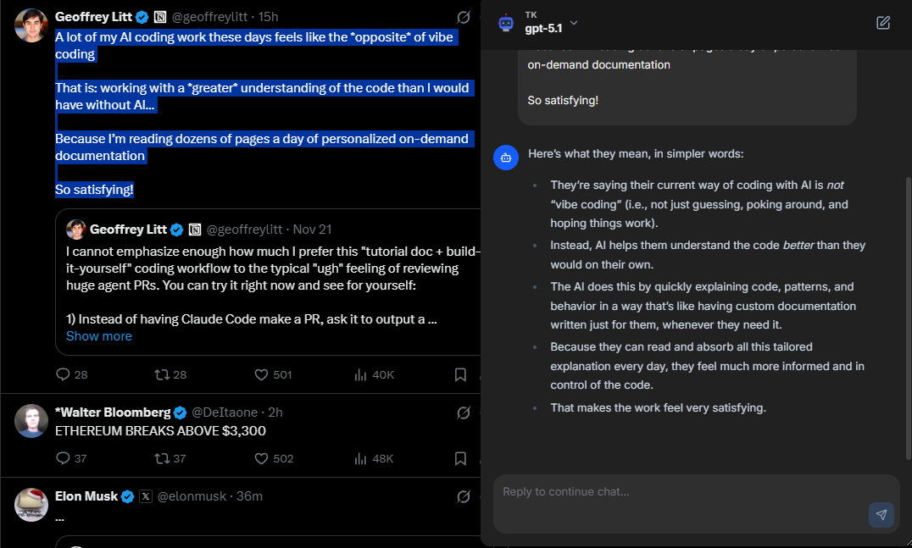
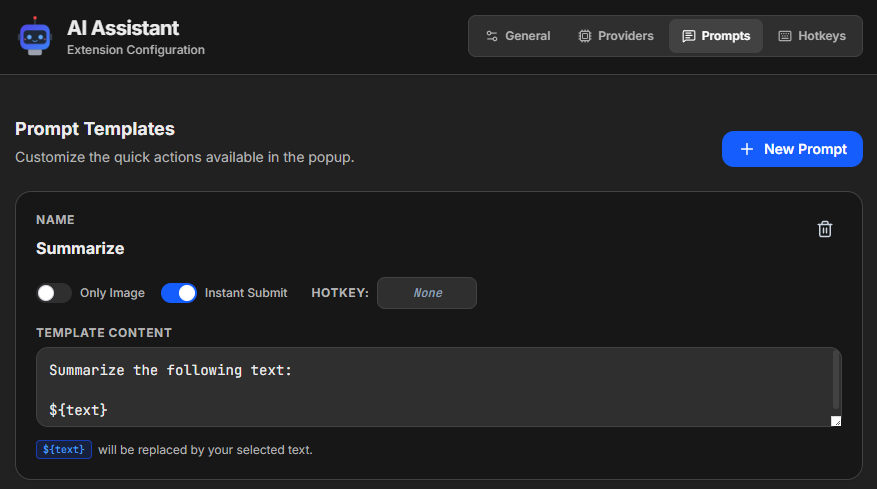

# AI Assistant

A powerful, modern Chrome extension that allows you to instantly process selected text using various AI providers (Google Gemini, OpenAI, Anthropic Claude, OpenRouter) using your own API keys.





## Features

### 🎯 Context Input
*   **Text Selection**: Select text on any webpage and instantly send it to an AI model.
*   **Image Selection**: Right-click any image on a webpage to ask AI about it.
*   **Screen Cropping**: Use a customizable hotkey to crop any area of the webpage (like a snipping tool) and attach it to your query.
*   **Multi-Modal**: Combine text and images in your conversations.

### 🤖 Multi-Provider Support
Native support for multiple AI providers:
*   **Google AI Studio** (Gemini models)
*   **OpenAI** (GPT-4o, GPT-3.5, etc.)
*   **Anthropic** (Claude 3.5 Sonnet, Haiku, etc.)
*   **OpenRouter** (Access to Llama 3, Mistral, and more)
*   **Custom Providers**: Add your own OpenAI-compatible endpoints

### ⚡ Real-Time Streaming
*   Live streaming responses from AI models
*   See responses as they're generated
*   Interrupt and resume conversations

### 📝 Custom Prompts
*   Create and manage reusable prompt templates (e.g., "Summarize", "Explain like I'm 5", "Translate")
*   Assign custom hotkeys to prompts for quick execution
*   Mark prompts as "Image Only" for vision-specific tasks

### 🔐 Secure Key Management
*   Store multiple API keys for each provider
*   Keys are stored locally in your browser (Chrome Sync Storage)
*   **Load Balancing**: Randomly selects one of your stored keys for each request to distribute usage

### ⌨️ Keyboard Shortcuts
*   **Global Popup Hotkey**: `Ctrl+Shift+Y` (Windows/Linux) or `Command+Shift+Y` (Mac)
*   **Custom Crop Hotkey**: Configure your own hotkey for screen cropping
*   **Prompt Hotkeys**: Assign hotkeys to specific prompts for one-click execution

### ⚙️ Customizable
*   Configure custom Base URLs (useful for proxies or local LLMs)
*   Specify custom Model IDs
*   Choose between extension popup or in-page popup mode
*   Export/Import settings for backup or sync across devices

### 💬 Chat Interface
*   Markdown rendering with code syntax highlighting
*   Copy message content with one click
*   Persistent chat history within sessions
*   Dark mode support

### 🎨 Modern UI
*   Clean, responsive interface built with React, TypeScript, and Tailwind CSS
*   Smooth animations and transitions
*   Draggable in-page popup

## Installation

### From Source (Developer Mode)

1.  **Clone the repository:**
    ```bash
    git clone <repository-url>
    cd ai-ask
    ```

2.  **Install dependencies:**
    ```bash
    npm install
    ```

3.  **Build the project:**
    ```bash
    npm run build
    ```
    This will create a `dist` folder containing the compiled extension.

4.  **Load into Chrome:**
    *   Open Chrome and navigate to `chrome://extensions/`.
    *   Enable **Developer mode** (toggle switch in the top right).
    *   Click **Load unpacked**.
    *   Select the `dist` folder generated in step 3.

## Usage

1.  **Configuration**:
    *   Click the extension icon in the toolbar (or right-click and select Options).
    *   Go to the **Settings** page.
    *   Select your default provider.
    *   Add your API Key(s).
    *   (Optional) Customize the Model ID if you want to use a specific model version.

2.  **Asking AI**:
    *   Highlight any text on a webpage.
    *   Open the popup via:
        *   **Keyboard Shortcut**: `Ctrl+Shift+Y` (Windows/Linux) or `Command+Shift+Y` (Mac).
        *   **Context Menu**: Right-click the selection and choose "Ask AI with selection".
        *   **Toolbar Icon**: Click the AI Ask icon.
    *   The selected text will appear in the popup.
    *   Select a **Preset Instruction** (e.g., "Summarize") or type a custom instruction.
    *   Click **Ask AI**.

## Development

This project is built with:
*   [Vite](https://vitejs.dev/)
*   [React](https://react.dev/)
*   [TypeScript](https://www.typescriptlang.org/)
*   [Tailwind CSS](https://tailwindcss.com/)

### Project Structure

*   `src/popup`: The main popup UI (React app).
*   `src/options`: The settings page (React app).
*   `src/background`: Service worker for background tasks and context menu handling.
*   `src/lib`: Shared utilities (storage, API calls, types).

### Commands

*   `npm run dev`: Start Vite dev server (useful for UI development, but extension APIs won't work fully outside Chrome).
*   `npm run build`: Type-check and build the extension for production (auto-bumps version).
*   `npm run build:ci`: Build for CI environments (no version bump).
*   `npm run lint`: Run ESLint.

## CI/CD

This project uses GitHub Actions for automated builds and releases.

### Automated Builds

The workflow (`.github/workflows/build-crx.yml`) runs on every push to `main` or `master` branches, but **only builds when the version in `package.json` changes**.

**What happens:**
1. **Version Check**: Compares current version with the previous commit
2. **Build**: If version changed, builds the extension using `npm run build:ci`
3. **Artifacts**: Uploads the extension as a ZIP file and unpacked folder
4. **Release**: Creates a GitHub Release with the ZIP file attached

### Triggering a Release

1. Run `npm run build` locally (this auto-increments the version)
2. Commit and push your changes
3. The workflow will detect the version change and create a new release

### Manual Build

You can also trigger a build manually from the Actions tab:
1. Go to **Actions** → **Build Chrome Extension**
2. Click **Run workflow**
3. Check **"Force build even without version change"** if needed
4. Click **Run workflow**

### Installing from Release

1. Go to the [Releases](../../releases) page
2. Download the latest `ai-assistant-x.x.x.zip` file
3. Extract the contents to a folder
4. Open Chrome → `chrome://extensions/`
5. Enable **Developer mode**
6. Click **Load unpacked** and select the extracted folder

## License

MIT