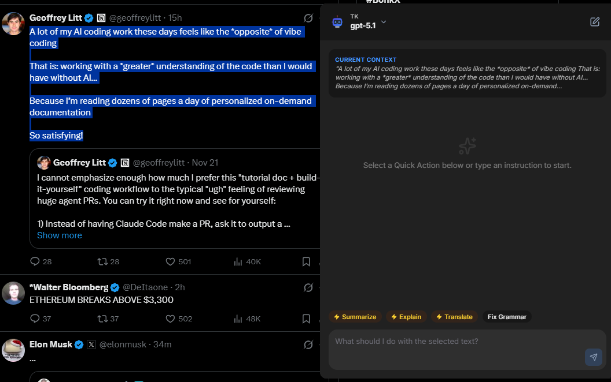
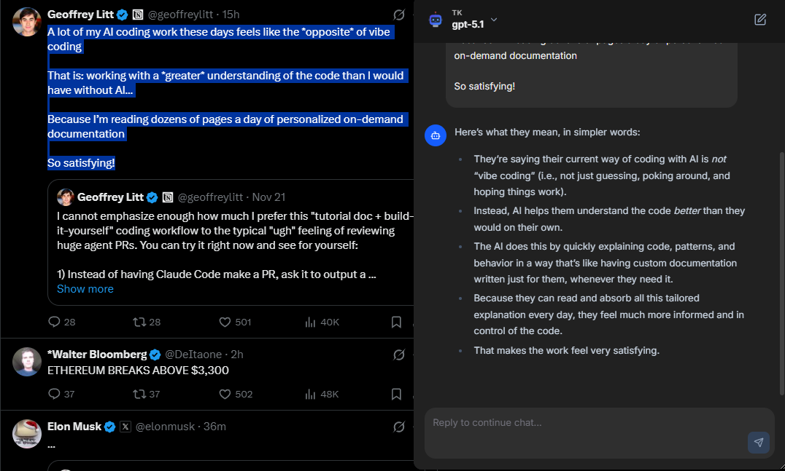

# AI Assistant

A powerful, modern Chrome extension that allows you to instantly process selected text and images using various AI providers with your own API keys. Features real-time streaming responses, web search integration, and a beautiful chat interface.




## ✨ Features

### 🎯 Context Input
- **Text Selection**: Select text on any webpage and instantly send it to an AI model
- **Image Selection**: Right-click any image on a webpage to ask AI about it
- **Screen Cropping**: Use a customizable hotkey to crop any area of the webpage (like a snipping tool) and attach it to your query
- **Multi-Modal**: Combine text and images in your conversations

### 🤖 Multi-Provider Support
Native support for multiple AI providers:
- **Chrome Gemini Nano**: Free, private, on-device AI that runs locally on your computer with no API key
- **Google AI Studio** (Gemini 3 Pro, Gemini 2.5 Flash, etc.)
- **OpenAI** (GPT-5.2, o3, o1, GPT-4o, etc.)
- **Anthropic** (Claude 4.5 Opus, Claude 4.5 Sonnet, Claude 4.5 Haiku, etc.)
- **OpenRouter** (Access to Llama 3.3, Grok 4.1, DeepSeek, Qwen, and more)
- **Perplexity** (Sonar with built-in web search)
- **Custom Providers**: Add your own OpenAI-compatible endpoints

### 🔍 Web Search Integration
AI models can search the web for up-to-date information:
- **Perplexity**: Use Perplexity API for web search via function calling
- **Kagi**: Use Kagi search with your session cookie
- **Sources Display**: View clickable citations from search results
- Works with any AI provider (except Perplexity which has built-in search)

### ⚡ Real-Time Streaming
- Live streaming responses from AI models
- See responses as they're generated
- Interrupt and resume conversations
- Response time tracking

### 📝 Custom Prompts
- Create and manage reusable prompt templates (e.g., "Summarize", "Explain like I'm 5", "Translate")
- Assign custom hotkeys to prompts for quick execution
- Mark prompts as "Image Only" for vision-specific tasks
- Use `${text}` placeholder for selected text

### 🔐 Secure Key Management
- Store multiple API keys for each provider
- Keys are stored locally in your browser (Chrome Sync Storage)
- **Load Balancing**: Randomly selects one of your stored keys for each request to distribute usage
- Automatic key rotation when quota is exhausted

### 🔄 Backup Models
- Configure multiple alternative models from any provider
- **Quick Model Switching**: Click "Try with another model" below any AI response to retry with a different model
- **Flexible Workflow**: Use fast models (e.g., `gemini-3-flash`) for daily tasks, then instantly try powerful models (e.g., `gemini-3-pro`) when you need better results
- **No Context Loss**: The same query is automatically sent to the backup model without retyping
- **Smart Prioritization**: Current provider appears first in the selection list
- **Custom Models Supported**: Add any model from fetched lists or enter custom model IDs

### ⌨️ Keyboard Shortcuts
- **Global Popup Hotkey**: `Ctrl+Shift+Y` (Windows/Linux) or `Command+Shift+Y` (Mac)
- **Custom Crop Hotkey**: Configure your own hotkey for screen cropping
- **Prompt Hotkeys**: Assign hotkeys to specific prompts for one-click execution

### ⚙️ Customizable
- Configure custom Base URLs (useful for proxies or local LLMs)
- Specify custom Model IDs or select from fetched models
- Choose between extension popup or in-page popup mode
- Adjustable popup size
- Export/Import settings for backup or sync across devices

### 💬 Chat Interface
- Markdown rendering with code syntax highlighting
- Copy message content with one click
- Persistent chat history within sessions
- Stream interruption handling with visual indicator
- Dark mode support

### 🎨 Modern UI
- Clean, responsive interface built with React, TypeScript, and Tailwind CSS
- Smooth animations and transitions
- Draggable in-page popup
- Light/Dark/System theme options

## 📦 Installation

### From Release (Recommended)

1. Go to the [Releases](../../releases) page
2. Download the latest `ai-assistant-x.x.x.zip` file
3. Extract the contents to a folder
4. Open Chrome → `chrome://extensions/`
5. Enable **Developer mode** (toggle in top right)
6. Click **Load unpacked** and select the extracted folder

### From Source (Developer Mode)

1. **Clone the repository:**
   ```bash
   git clone <repository-url>
   cd ai-ask
   ```

2. **Install dependencies:**
   ```bash
   npm install
   ```

3. **Build the project:**
   ```bash
   npm run build
   ```
   This will create a `dist` folder containing the compiled extension.

4. **Load into Chrome:**
   - Open Chrome and navigate to `chrome://extensions/`
   - Enable **Developer mode** (toggle switch in the top right)
   - Click **Load unpacked**
   - Select the `dist` folder generated in step 3

## 🚀 Usage

### Initial Setup

1. Click the extension icon in the toolbar (or right-click and select Options)
2. Go to the **Settings** page
3. Select your default AI provider
4. Add your API Key(s)
5. (Optional) Customize the Model ID or fetch available models
6. (Optional) Set up web search with Perplexity API key or Kagi session

### Asking AI

1. **Select text or image** on any webpage
2. **Open the popup** via:
   - **Keyboard Shortcut**: `Ctrl+Shift+Y` (Windows/Linux) or `Command+Shift+Y` (Mac)
   - **Context Menu**: Right-click and choose "Ask AI with selection" or "Ask AI about this image"
   - **Toolbar Icon**: Click the AI Assistant icon
3. The selected content will appear in the popup
4. Select a **Preset Instruction** or type a custom question
5. Click **Ask AI** or press Enter

### Using Backup Models

1. **Configure Backup Models** (one-time setup):
   - Go to **Settings** → **Providers** tab
   - Scroll to the **Backup Models** section
   - Click **"Add Backup Model"**
   - Select a provider from the dropdown (your current provider appears first)
   - **Models are automatically fetched** when you select a provider
   - Choose a model from the list, or toggle to "Custom Model" to enter any model ID manually
   - Click **Add Model**
   - Repeat to add multiple backup models from different providers

2. **Try with Another Model**:
   - After receiving any AI response, you'll see a **"Try with another model"** button below it
   - Click the button to see your configured backup models
   - Select any backup model from the dropdown
   - The current response will be removed and the same query will be sent to the selected model
   - Your default model selection remains unchanged for future queries

### Screen Cropping

1. Configure a crop hotkey in Settings → Hotkeys
2. Press your hotkey to activate the snipping tool
3. Draw a rectangle to capture the area
4. The captured image will be attached to your next query

## 🛠️ Development

This project is built with:
- [Vite](https://vitejs.dev/) - Fast build tool
- [React](https://react.dev/) - UI framework
- [TypeScript](https://www.typescriptlang.org/) - Type safety
- [Tailwind CSS](https://tailwindcss.com/) - Styling

### Project Structure

```
src/
├── background/     # Service worker for context menu and API proxying
├── components/     # Shared React components (ChatInterface)
├── content/        # Content script for in-page popup
├── lib/            # Shared utilities (API, storage, types, hooks)
├── options/        # Settings page (React app)
└── popup/          # Extension popup (React app)
```

### Commands

| Command | Description |
|---------|-------------|
| `npm run dev` | Start Vite dev server (for UI development) |
| `npm run build` | Type-check and build for production (auto-bumps version) |
| `npm run build:ci` | Build for CI environments (no version bump) |
| `npm run lint` | Run ESLint |

## 🔄 CI/CD

This project uses GitHub Actions for automated builds and releases.

### Automated Builds

The workflow (`.github/workflows/build-crx.yml`) runs on every push to `main` or `master` branches, but **only builds when the version in `package.json` changes**.

**What happens:**
1. **Version Check**: Compares current version with the previous commit
2. **Build**: If version changed, builds the extension using `npm run build:ci`
3. **Artifacts**: Uploads the extension as a ZIP file and unpacked folder
4. **Release**: Creates a GitHub Release with the ZIP file attached

### Triggering a Release

1. Run `npm run build` locally (this auto-increments the version)
2. Commit and push your changes
3. The workflow will detect the version change and create a new release

### Manual Build

You can trigger a build manually from the Actions tab:
1. Go to **Actions** → **Build Chrome Extension**
2. Click **Run workflow**
3. Check **"Force build even without version change"** if needed
4. Click **Run workflow**

## 📄 License

MIT
